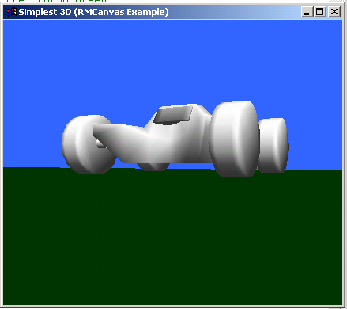

## \_The Simplest DirectX example

### Description

***It's the simplest directX example here!!!***

If don't know anything about DX, this is the perfect code for you.

No Modules or Classes, just one form with little code. Even includes conv3ds.exe, which lets you convert your 3DS files to .x files which are used in VB. You can easily add them into the world you can create.

*** GREAT CODE!!! ***

***Heavily commented***

DON'T FORGET TO VOTE AND COMMENT

LOOK BELOW IN THE COMMENTS FOR URL OF RMCONTROL.ocx AND 3dconv.exe
 
### More Info
 

             |
---                |---
**Submitted On**   |2002-05-05 15:24:06
**By**             |[Tomas Tupy](https://github.com/Planet-Source-Code/PSCIndex/blob/master/ByAuthor/tomas-tupy.md)
**Level**          |Intermediate
**User Rating**    |4.1 (94 globes from 23 users)
**Compatibility**  |VB 5\.0, VB 6\.0
**Category**       |[DirectX](https://github.com/Planet-Source-Code/PSCIndex/blob/master/ByCategory/directx__1-44.md)
**World**          |[Visual Basic](https://github.com/Planet-Source-Code/PSCIndex/blob/master/ByWorld/visual-basic.md)
**Archive File**   |[The\_Simple79739552002\.zip](https://github.com/Planet-Source-Code/tomas-tupy-the-simplest-directx-example__1-34483/archive/master.zip)

